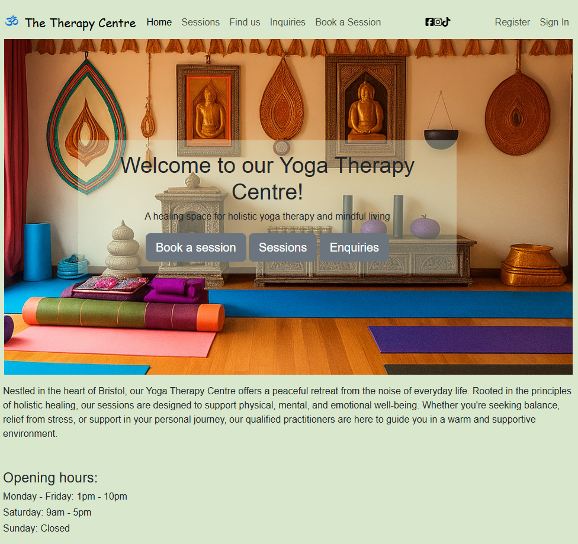
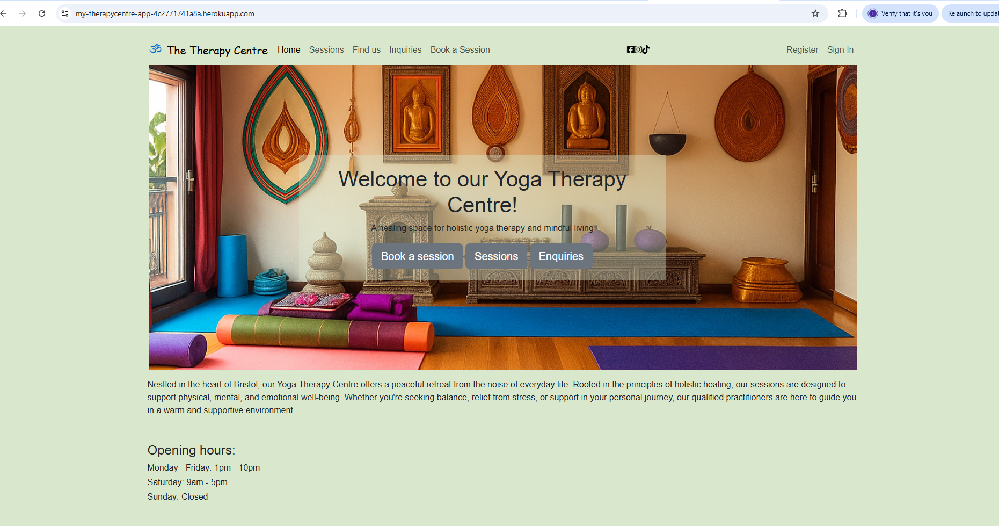
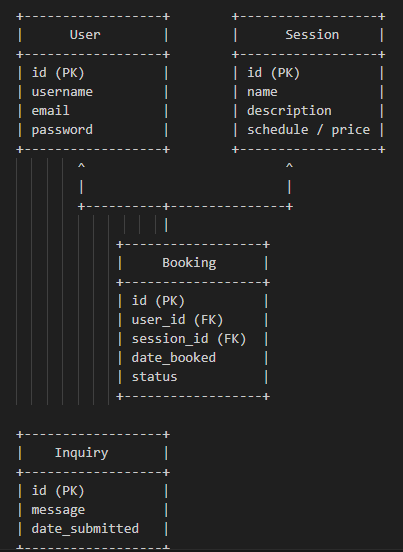
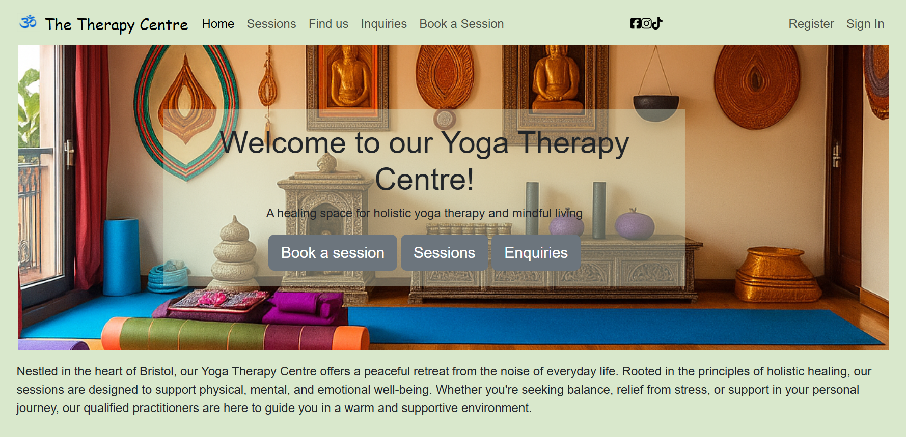
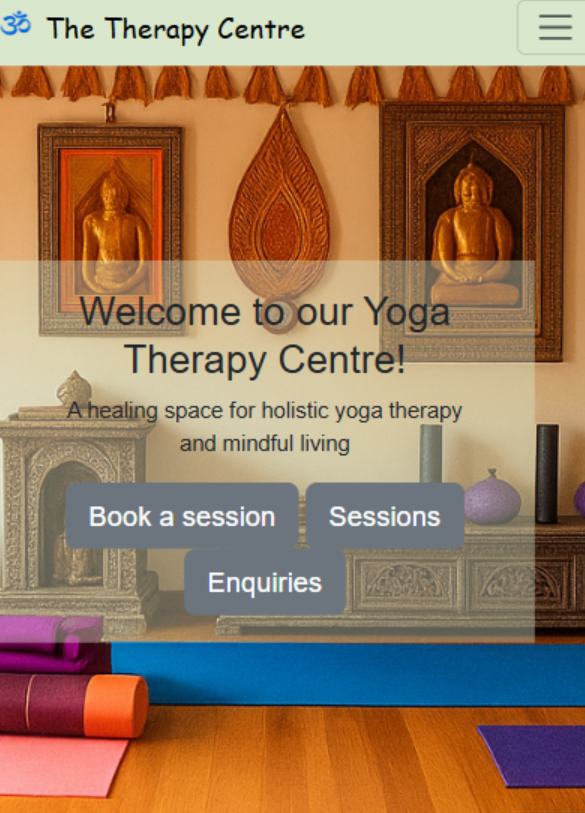
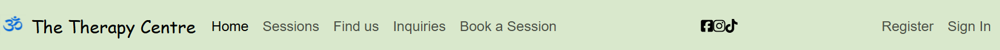
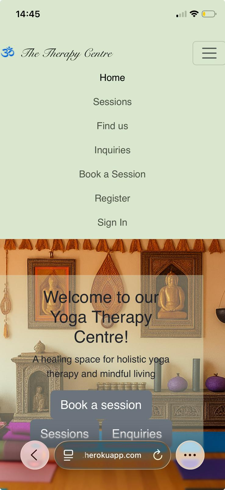

This will be my Read

# 🌿 Therapy Centre – Holistic Yoga in the Heart of Bristol

**Therapy Centre** is a thoughtfully designed wellness website inspired by a peaceful yoga retreat based in the heart of Bristol. The project focuses on holistic yoga therapy and provides users with an intuitive and calming digital experience.

- This full-stack web application allows users to:

- Book group yoga sessions by selecting a preferred date and time

- View a comprehensive list of services

- Contact the centre directly through the website

- Access key information such as location and directions

Developed using the **Django framework**, the application implements full CRUD functionality, enabling users to easily create, view, update, and cancel their session bookings.

Live site can be seen [here](https://my-therapycentre-app-4c2771741a8a.herokuapp.com/).

Images were sourced from **Chrome**

Table of Contents 

- [UX/UI Design](#uxui-design)
  - [User Stories](#user-stories)
  - [Wireframes](#wireframes)
  - [Colour scheme](#colour-scheme)
  - [Project Planning](#project-planning)
    - [Agile methodologies](#agile-methodologies)
    - [Database design](#database-design)
- [Features](#features)
  - [Existing features](#existing-features)
  - [Landing page](#landing-page)
  - [Navigation menu](#navigation-menu)
  - [Admin dashboard](#admin-dashboard)
  - [Potential future features](#potential-future-features)
- [Technologies used](#technologies-used)
  - [Languages](#languages)
  - [Database](#database)
  - [Frameworks](#frameworks)
  - [Libraries & Additional Programs/Software/Tools](#libraries--additional-programssoftwaretools)
- [Manual Testing](#manual-testing)
  - [Responsiveness](#responsiveness)
  - [Browser compability](#browser-compability)
  - [Validator testing](#validator-testing)
  - [User Story testing](#user-story-testing)
  - [Bugs](#bugs)
- [Deployment](#deployment)
  - [Forking](#forking)
  - [Cloning](#cloning)
  - [Deployment to Heroku](#deployment-to-heroku)
- [References/credit](#referencescredit)
  - [Content](#content)
  - [Media](#media)

## UX/UI Design

### User Stories

**EPIC 1: Book a Session**

As a **Site User**, I can book a session at the therapy centre online so that I can choose a date, time, and type of session that suits me.

As a **Site User**, I want the booking process to be simple and intuitive so that I can complete a booking with ease.

As a **Site User**, I can provide specific information (e.g., special requirements) so that the therapist is aware in advance.

As a **Site User**, I can receive an email confirmation of my booking so that I can refer back to the details later.

As a **Site User**, I can view the therapy centre’s booking policy before submitting the form so that I know what to expect.

As a **Site Admin**, I can view all upcoming bookings by day, week, or month so that I can ensure sessions are properly scheduled and staffed.

**EPIC 2: Manage Bookings**

As a **Site User**, I can register an account so that I can view and manage my bookings online.

As a **Site User**, I can log in to my account from any device so that I can access or update my bookings at any time.

As a **Site User**, I can edit or cancel my bookings online so that I can adjust them if my plans change.

As a **Site User**, I can delete my bookings myself so that I don’t need to contact the therapy centre to make changes.

As a **Site User**, I can view the total number of clients booked per session so that I can manage capacity effectively.

As a **Site Admin**, I can modify bookings through the admin panel in case a client needs assistance updating their booking.

**EPIC 3: Contact the Therapy Centre**

As a **Site User**, I can easily find the therapy centre’s contact details so that I can reach out with questions or special requests.

As a **Site User**, I can view the therapy centre’s opening hours so that I know the best times to contact them.

As a **Site User**, I can fill out a contact form so that I can send inquiries without having to call or email separately.

As a **Site Admin**, I can view all incoming messages from the contact form so that I can respond promptly.

**EPIC 4: Locate the Therapy Centre**

As a **Site User**, I can find information about the therapy centre’s address so that I know where it is located.

As a **Site User**, I can view a map of the therapy centre’s location so that I can navigate there by car, public transport, or on foot.

**EPIC 5: View Available Sessions**

As a **Site User**, I can view a list of available sessions so that I can decide which one I would like to attend.

As a **Site Admin**, I can easily update session details and pricing so that clients always have accurate, up-to-date information.

**EPIC 6: Reviews**

As a **Site User**, I can write a review of the therapy centre so that others can learn from my experience.

As a **Site User**, I can read reviews from previous clients so that I can make an informed decision about booking a session.

As a **Site Admin**, I can moderate and respond to reviews so that feedback is managed professionally and constructively.

### Wireframes

Wireframes for both mobile devices and larger screens (such as tablets and desktop computers) were created using **Balsamiq and Microsoft Word**. The goal was to maintain a clean and straightforward design, with nearly every view having its own dedicated wireframe. This approach streamlined the development process, as the layout and structure were already clearly defined.

I thoroughly enjoyed working on this stage of the project. While a few adjustments were made during development—particularly to improve responsiveness—I decided to keep all original wireframes unchanged as a reference to the initial design vision.

**Examples**

The first example below showcases the landing page as viewed on a desktop browser or large tablet. It highlights the navigation bar with all menu items visible, a prominent header image (jumbotron), and what I consider the two most essential buttons for a therapy’s website from a user perspective.

These wireframes illustrate the mobile layout, designed to be clean and intuitive. A dropdown menu replaces the traditional navigation bar to maximize screen space, keeping the focus on the jumbotron, booking, and menu sections.

For a complete overview of the project’s wireframes, please refer to the dedicated documentation. The main README provides only a brief visual summary to maintain clarity and brevity. To explore all wireframe designs, including detailed layouts, click the link below:

[View Full Wireframes](docs/wireframes.md)

### Colour scheme

The website uses a calm and natural colour palette to create a soothing and welcoming atmosphere appropriate for a therapy centre. The primary background colour is a soft, muted green (#d9e8cc), chosen to evoke feelings of calmness and peace. Buttons and interactive elements use Bootstrap’s neutral grey tones to maintain a clean, professional appearance without clashing with the primary background. Social media icons are styled in black for clear visibility and a minimalist aesthetic. This colour scheme aims to provide a gentle and reassuring user experience, reinforcing the centre’s commitment to comfort and care.

### Project planning

### Agile methodologies

Agile Methodologies in My Project

Excel Planning Board – I used Excel to plan and organize the Yoga Therapy Centre project. Each issue was written as a User Story with clear Acceptance Criteria. To make sure I understood the scope of each story, I also broke them down into smaller tasks. Along the way, I had to revisit the sheet, refine, and add new User Stories. This process highlighted for me the value of an iterative Agile approach.

The User Stories helped me stay focused on ensuring the essential functionality of the site came first, with design as an enhancement rather than the main priority.

Epics – I see the value of Epics in larger projects, since they give a clearer overview of related User Stories and help with prioritization. For a project of this size, Epics might be more than necessary, but the structure still helps me organize my work and thinking.

MoSCoW Prioritization – To keep priorities clear, each User Story was categorized using the MoSCoW methodology:

Must Have: Essential features required for the Yoga Therapy Centre website to function and serve its core purpose.

Should Have: Important features that add value but are not critical for basic functionality.

Could Have: Nice-to-have features that can be developed if time and resources allow.

Won’t Have (this time): Features intentionally left out of this version but considered for possible future development.

An important note: some features that I consider essential for a Yoga Therapy Centre’s website and booking system (and therefore labeled as Must Have) were not implemented in this iteration. They didn’t even reach the “In Progress” stage in Excel. This was intentional, as my main focus for this project is on building a smooth and supportive user experience for clients. Administrative and back-office functionality is something I would be very interested in exploring in future versions of the project.

## Database Design

The Therapy Centre web application is structured into three main Django apps:

The core app handles static pages, including the home page, “Find Us” page, and the sessions page, which displays information about the yoga therapy sessions such as schedule, types, and pricing.

The booking app manages user accounts and session bookings. Users can sign up, log in, view their bookings, update or cancel them, and track their booking history.

The inquiries app allows users to submit queries through a contact form, storing their requests for follow-up.

The database schema is designed to maintain clear relationships between users, their bookings, and inquiries, ensuring consistency and easy data access.

Legend:

PK = Primary Key

FK = Foreign Key

Arrows indicate relationships:

A user can have many bookings.

Each booking references one session.

Inquiry is independent and can exist without a user account.

## Features

### Existing features

The website is organised into multiple interconnected pages, all of which incorporate consistent design elements to promote a cohesive and seamless user experience. Key components, including a navigation bar featuring the site logo and clearly structured navigational links, as well as a footer containing essential contact information, are implemented uniformly across the site. The homepage serves as an introductory interface, providing users with an overview of the therapy services offered.

Authentication-related links, including sign up, log in, and log out, are accessible across all pages, ensuring that users can conveniently manage and access their accounts regardless of their location within the website.

### Landing-page

The landing page is designed to clearly and efficiently communicate the purpose and core services of the therapy centre. It features a prominent header image displaying the centre’s name, accompanied by a concise tagline intended to provide visitors with an immediate understanding of the nature of the services offered. Two clearly defined call-to-action buttons are presented, enabling users to either book an appointment or access detailed information about the available yoga services, which represent the primary functional objectives of the website.

Positioned beneath the header section is a brief informational area that provides further contextual insight into the therapy centre’s values and therapeutic approach. Additionally, the inclusion of the centre’s opening hours addresses a common user requirement, as such information is frequently sought by visitors to healthcare and wellness-related websites.

The mobile version of the website retains the same core functionality while employing a responsive design to ensure accessibility and usability across a range of screen sizes and devices. Although further optimisation—such as adjusting font sizes for smaller screens—could enhance readability, these refinements were considered outside the scope of the current development priorities.

### Navigation Menu

The navigation menu provides structured access to the website’s primary content and functional pages. It includes links to key sections such as Contact, Location, and Therapy Services, as well as a prominently styled call-to-action button directing users to the appointment booking page. These elements are designed to support intuitive navigation and efficient user interaction.

In addition, the navigation menu incorporates links to the therapy centre’s social media platforms. At the current stage of development, these links direct users to the respective social media landing pages. Positioned at the far right of the navigation bar are authentication-related links, allowing users to register or sign in. User authentication enables access to personalised functionality, including the ability to view, edit, or cancel appointments, thereby supporting full CRUD (Create, Read, Update, Delete) operations.

Once authenticated, users are presented with alternative navigation options, specifically “My Appointments” and “Logout”, replacing the registration and sign-in links. This dynamic behaviour enhances usability by displaying contextually relevant options based on the user’s authentication status.

Through the use of Bootstrap components and custom CSS styling, the navigation menu adapts responsively to smaller screen sizes by transforming into a dropdown menu. To preserve clarity and minimise visual clutter on mobile devices, social media icons are hidden from the navigation menu on smaller screens and are instead displayed exclusively within the website footer.

### Admin Dashboard

The administrative interface is provided through Django’s built-in dashboard. A superuser account was created to facilitate administrative access, enabling the management of other users, who can be assigned either superuser privileges or limited permissions such as viewing new bookings and messages.

Superusers have full control over site interactions, including the ability to review messages submitted through the Inquiries section, manage bookings, and perform actions such as modifying or deleting entries as required. 

### Potential future features

Potential future enhancements for the website include the integration of online payment functionality, which would allow clients to securely complete transactions directly through the platform, thereby streamlining the booking and payment process. Another prospective feature is the implementation of automated email notifications to confirm bookings, send reminders, or provide follow-up information, improving communication and client engagement. Additional enhancements could include incorporating a blog or resources section with wellness tips, yoga guidance, and therapeutic exercises, which could enhance user engagement and establish the centre as a trusted source of health and wellness information. Finally, integrating a feedback or review system would enable clients to provide testimonials, supporting continuous service improvement and fostering trust among prospective clients.

## Technologies used

### Technologies Used

| Category | Technology | Purpose / Description |
|----------|-----------|---------------------|
| **Frontend** | HTML5 | Defines the structure and layout of web pages. |
|  | CSS3 | Provides styling, layout, and visual enhancements. |
|  | Bootstrap 5 | Responsive framework for layout, grids, and UI components. |
|  | django-crispy-forms & crispy-bootstrap5 | Styles Django forms consistently with Bootstrap 5. |
|  | django-summernote | Embedded rich text editor for content creation in admin dashboard. |
|  | Cloudinary | Cloud-based media hosting and optimization. |
| **Backend** | Python | Core programming language for server-side logic. |
|  | Django 4.2.7 | Handles routing, authentication, templating, and database interactions. |
|  | Django-Allauth | Provides authentication, registration, and social account management. |
|  | dj-database-url | Simplifies database configuration via URL. |
|  | dj3-cloudinary-storage | Connects Django storage backend with Cloudinary. |
|  | Gunicorn | WSGI HTTP server for production deployment. |
|  | Whitenoise | Efficiently serves static files in production. |
|  | PostgreSQL (psycopg2-binary) | Relational database for storing users, bookings, and site data. |
|  | SQLParse | Library for parsing SQL queries in Django. |
|  | OAuthlib, Requests-OAuthlib, python3-openid, PyJWT | Support secure authentication and authorization workflows. |
|  | asgiref | Provides asynchronous support for Django applications. |
| **Tools & Deployment** | pip | Python package installer for managing dependencies. |
|  | Git | Version control system for tracking code changes. |
|  | Heroku | Cloud platform for deployment and hosting. |
| **Potential Future Tools/Technologies** | Stripe / PayPal APIs | Enable secure online payment processing through the website. |
|  | Django Email Backend / SendGrid / SMTP | Automate booking confirmations, reminders, and follow-up emails. |
|  | Django Rest Framework (DRF) | Potential for a client portal or API for appointments. |
|  | Chart.js / Plotly | Visualize client activity or booking statistics in the admin dashboard. |
|  | Feedback & Review Plugins | Collect client testimonials and ratings for service improvement. |
|  | Blog/Content Management Tools | Publish wellness tips, yoga exercises, and educational content. |

## Manual Testing

### Responsiveness

Responsiveness was tested manually using Chrome DevTools across multiple screen sizes and devices.

Third-party iframe-based tools such as Am I Responsive were tested but could not render the deployed Django application due to security headers and middleware enforced by Django in production. This behaviour is expected and does not impact the responsiveness or usability of the site.

### Browser compability
### Validator testing
### User Story testing
### Bugs

### Libraries & Additional Programs/Software/Tools

- [Deep Dream Generator](https://deepdreamgenerator.com/) - I utilized Deep Dream Generator, an AI-powered tool, to create images for my project.