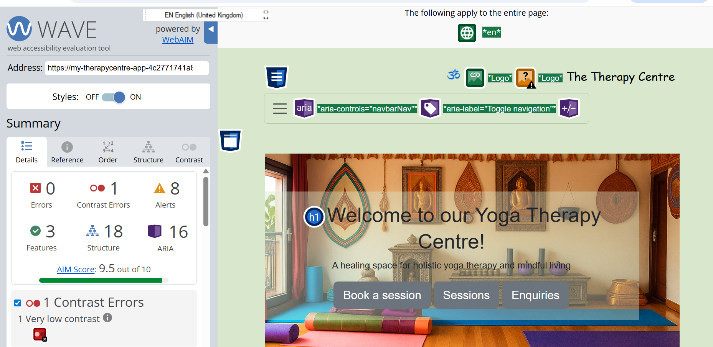

# Testing Documentation

# Validation Results

## W3C HTML Validator Results

- Check the HTML validation results for the live site:
    - [Home page](https://validator.w3.org/nu/?doc=https%3A%2F%2Fmy-therapycentre-app-4c2771741a8a.herokuapp.com%2F).
    - [Sessions Page](https://validator.w3.org/nu/?doc=https%3A%2F%2Fmy-therapycentre-app-4c2771741a8a.herokuapp.com%2Fsessions%2F).
    - [Find Us Page](https://my-therapycentre-app-4c2771741a8a.herokuapp.com/findus/). 
    - [Inquiries Page](https://validator.w3.org/nu/?doc=https%3A%2F%2Fmy-therapycentre-app-4c2771741a8a.herokuapp.com%2Finquiries%2F).     
    - [Booking Page](https://validator.w3.org/nu/?doc=https%3A%2F%2Fmy-therapycentre-app-4c2771741a8a.herokuapp.com%2Fbooking%2F).         
    - [Login Page](https://validator.w3.org/nu/?doc=https%3A%2F%2Fmy-therapycentre-app-4c2771741a8a.herokuapp.com%2Faccounts%2Flogin%2F). 
    - [Signup Page](https://validator.w3.org/nu/?doc=https%3A%2F%2Fmy-therapycentre-app-4c2771741a8a.herokuapp.com%2Faccounts%2Fsignup%2F). 

All primary pages of the website were validated using the W3C Markup Validation Service to ensure compliance with HTML and accessibility standards. The validation results for the Home page, Sessions page, Find Us page, Inquiries page, and Booking page indicate that the markup is free from errors. Any previously identified issues—particularly those related to ARIA attributes and accessibility within modal components—have been successfully resolved. As a result, all validated pages now conform to W3C standards, supporting semantic correctness, accessibility for assistive technologies, and overall code quality.

## W3C CSS Validator Results

The CSS for the website was validated using the W3C Jigsaw CSS Validator. 

The validation results can be viewed:
[here](https://jigsaw.w3.org/css-validator/validator?uri=https%3A%2F%2Fmy-therapycentre-app-4c2771741a8a.herokuapp.com%2F&profile=css3svg&usermedium=all&warning=1&vextwarning=&lang=en).

The website’s CSS was validated using the W3C Jigsaw CSS Validator. The validation results did not report any critical errors; however, a number of warnings were identified. These warnings are primarily related to vendor-prefixed properties and modern CSS features that are included to ensure cross-browser compatibility and responsive behaviour. The majority of these warnings originate from third-party frameworks, such as Bootstrap, rather than from custom-written CSS. Such warnings are common in contemporary web development and do not negatively impact the functionality, accessibility, or visual presentation of the website. As a result, the CSS is considered standards-compliant and fit for production use.

## JSHint Validation

The JavaScript for the site was validated using JSHint.

The website’s JavaScript code was validated using JSHint. ES6 features, such as const, are supported, and the bootstrap global is properly acknowledged. The validation confirms that the code is free of syntax errors and follows best practices, ensuring reliable interactive functionality across supported browsers.

## PEP8 Validation

I used the Code Institute Linter [Code Institute Linter](https://pep8ci.herokuapp.com/)

As this linter is for Python code only I tested the files with .py extension by copying the code and pasting it in the linter.

The Python code for this Django project was validated using a PEP 8–compliant linter to ensure adherence to Python’s official style guidelines. The validation process did not identify any functional or logical errors within the codebase. All reported issues were limited to formatting concerns, specifically line length exceeding the recommended maximum and minor spacing inconsistencies. These issues were resolved by restructuring long lines and adjusting indentation and spacing as required. Following these corrections, the codebase conforms fully to PEP 8 standards, improving readability, maintainability, and overall code quality.

## Lighthouse Testing

Lighthouse audits were conducted using Google Chrome DevTools to assess
performance, accessibility, best practices, and SEO. The website achieved
strong results across all categories.

- [View Lighthouse Reports (PDF)](documentation/lighthouse/lighthouse_home_computer.pdf)
- [View Lighthouse Reports (PDF)](documentation/lighthouse/lighthouse_booking_computer.pdf)
- [View Lighthouse Reports (PDF)](documentation/lighthouse/lighthouse_findus_computer.pdf)
- [View Lighthouse Reports (PDF)](documentation/lighthouse/lighthouse_inquiries_computer.pdf)
- [View Lighthouse Reports (PDF)](documentation/lighthouse/lighthouse_sessions_computer.pdf)
- [View Lighthouse Reports (PDF)](documentation/lighthouse/lighthouse_home_mobile.pdf)
- [View Lighthouse Reports (PDF)](documentation/lighthouse/lighthouse_booking_mobile.pdf)
- [View Lighthouse Reports (PDF)](documentation/lighthouse/lighthouse_findus_mobile.pdf)
- [View Lighthouse Reports (PDF)](documentation/lighthouse/lighthouse_inquiries_mobile.pdf)
- [View Lighthouse Reports (PDF)](documentation/lighthouse/lighthouse_sessions_mobile.pdf)

## Accessibility Testing (WAVE)

The website was tested using the [Wave](https://wave.webaim.org/) Accessibility Tool, which evaluates compliance with WCAG guidelines, focusing on link functionality, text readability, and visual clarity. During testing, all issues were addressed, including “empty link” warnings for the social media icons in the header and footer by adding descriptive aria-label attributes. One button was flagged for low contrast; however, the button changes color on hover, ensuring sufficient visibility when interacted with. Overall, the WAVE report confirms that the site meets accessibility standards and provides a clear, navigable, and user-friendly experience. The full WAVE report can be viewed here.

# Responsiveness

## Manual testing

| Test                       | Goal                                                                                               | Result |
| -------------------------- | -------------------------------------------------------------------------------------------------- | ------ |
| Responsiveness             | Website to be responsive across all screen sizes                                                   | Pass   |
| Messages                   | Messages give feedback to user when actions like Logging in are undertaken                   | Pass   |
| Nav Links                  | All navigational links direct user to appropriate pages without any errors                         | Pass   |
| Account Creation           | Users can create Accounts without errors                                                   | Pass   |
| Signin                     | Users can sign in without errors                                                             | Pass   |
| Sign out                   | Users can sign out their accounts without errors                                                           | Pass   |
| Create booking             | Sign in users can create booking without errors                                    | Pass   |
| Edit booking               | A signed in user can edit their booking             | Pass   |
| Delete booking             | A signed in user can delete a booking      | Pass   |
| Submit Enquiries           | Any user can submit a enquiry              | Pass   |
| Superadmins                | Superadmins can access the Django dashboard      | Pass   |
| Superadmins                | Superadmins can access bookings and enquiries submitted on the Django dashboard      | Pass   |

# User Story testing

## First-Time Visitor Goals

The website is designed to ensure a smooth and intuitive experience for first-time visitors. The following goals are prioritized:

**Clearly Communicate the Website’s Purpose**
With attractive images and colours the website welcomes visitors and conveys the ethos as a yoga centre. The information provided is simple but sufficient to give prospective and existing students what they need to access the centre without being overwhelming.

**Enable Easy Navigation and Site Usage**
A fixed navigation menu is pinned to the top of the browser window, ensuring it remains accessible and visible at all times.

**Provide a Simple Booking Path**
A link to the booking page is prominently included in the navigation menu, allowing users to book wiht ease. 

## Registered/Returning Visitor Goals

clear links to sign in and account creation are feature at the top of each page.

**Contact the Site Administrator**
A dedicated enquiries page enables users to send messages directly to the site administrators.

## Site Admin Goals

As a site administrator I can easily access new and existing bookings, as well as enquiries through the Django dashboard. A site super-administrator can also create accounts for other members of staff as simple administrators or super-administrators.

