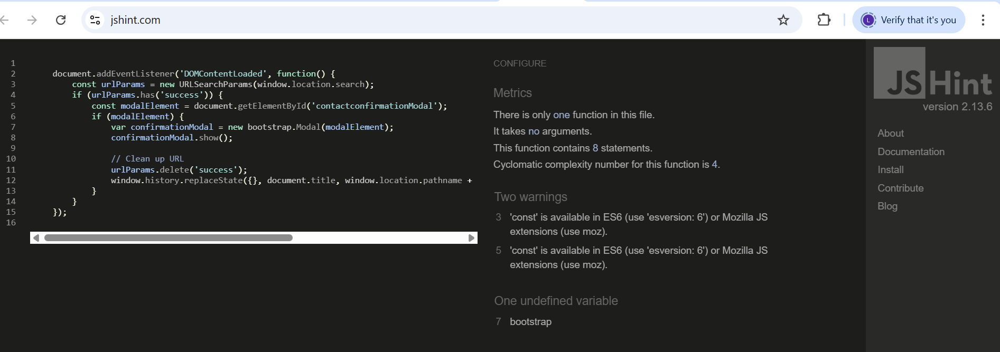

# Testing Documentation

# Validation Results

## W3C HTML Validator Results

- Check the HTML validation results for the live site:
    - [Home page](https://validator.w3.org/nu/?doc=https%3A%2F%2Fmy-therapycentre-app-4c2771741a8a.herokuapp.com%2F).
    - [Sessions Page](https://validator.w3.org/nu/?doc=https%3A%2F%2Fmy-therapycentre-app-4c2771741a8a.herokuapp.com%2Fsessions%2F).
    - [Find Us Page](https://my-therapycentre-app-4c2771741a8a.herokuapp.com/findus/). 
    - [Inquiries Page](https://validator.w3.org/nu/?doc=https%3A%2F%2Fmy-therapycentre-app-4c2771741a8a.herokuapp.com%2Finquiries%2F).     
    - [Booking Page](https://validator.w3.org/nu/?doc=https%3A%2F%2Fmy-therapycentre-app-4c2771741a8a.herokuapp.com%2Fbooking%2F).         
    - [Login Page](https://validator.w3.org/nu/?doc=https%3A%2F%2Fmy-therapycentre-app-4c2771741a8a.herokuapp.com%2Faccounts%2Flogin%2F). 
    - [Signup Page](https://validator.w3.org/nu/?doc=https%3A%2F%2Fmy-therapycentre-app-4c2771741a8a.herokuapp.com%2Faccounts%2Fsignup%2F). 

All primary pages of the website were validated using the W3C Markup Validation Service to ensure compliance with HTML and accessibility standards. The validation results for the Home page, Sessions page, Find Us page, Inquiries page, and Booking page indicate that the markup is free from errors. Any previously identified issues—particularly those related to ARIA attributes and accessibility within modal components—have been successfully resolved. As a result, all validated pages now conform to W3C standards, supporting semantic correctness, accessibility for assistive technologies, and overall code quality.

## W3C CSS Validator Results

The CSS for the website was validated using the W3C Jigsaw CSS Validator. 

The validation results can be viewed:
[here](https://jigsaw.w3.org/css-validator/validator?uri=https%3A%2F%2Fmy-therapycentre-app-4c2771741a8a.herokuapp.com%2F&profile=css3svg&usermedium=all&warning=1&vextwarning=&lang=en).

The website’s CSS was validated using the W3C Jigsaw CSS Validator. The validation results did not report any critical errors; however, a number of warnings were identified. These warnings are primarily related to vendor-prefixed properties and modern CSS features that are included to ensure cross-browser compatibility and responsive behaviour. The majority of these warnings originate from third-party frameworks, such as Bootstrap, rather than from custom-written CSS. Such warnings are common in contemporary web development and do not negatively impact the functionality, accessibility, or visual presentation of the website. As a result, the CSS is considered standards-compliant and fit for production use.

## JSHint Validation

The JavaScript for the site was validated using JSHint.

The website’s JavaScript code was validated using JSHint. ES6 features, such as const, are supported, and the bootstrap global is properly acknowledged. The validation confirms that the code is free of syntax errors and follows best practices, ensuring reliable interactive functionality across supported browsers.

## PEP8 Validation

I used the Code Institute Linter [Code Institute Linter](https://pep8ci.herokuapp.com/)

As this linter is for Python code only I tested the files with .py extension by copying the code and pasting it in the linter.

The Python code for this Django project was validated using a PEP 8–compliant linter to ensure adherence to Python’s official style guidelines. The validation process did not identify any functional or logical errors within the codebase. All reported issues were limited to formatting concerns, specifically line length exceeding the recommended maximum and minor spacing inconsistencies. These issues were resolved by restructuring long lines and adjusting indentation and spacing as required. Following these corrections, the codebase conforms fully to PEP 8 standards, improving readability, maintainability, and overall code quality.